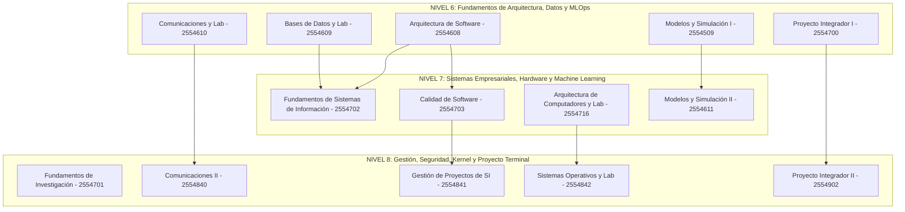

# Hoja de Ruta y Portafolio de Proyectos – Etapa 2 (Niveles 6, 7 y 8)
### Programa Oficial de Ingeniería de Sistemas – Universidad de Antioquia (UdeA)

Bienvenido a la guía avanzada de proyectos de software, infraestructura, ciberseguridad e inteligencia artificial diseñada para las materias de los **Niveles 6, 7 y 8** de tu carrera.

Cada documento Markdown en esta carpeta ha sido elaborado con base en los **14 microcurrículos oficiales de la carpeta `materias_por_ver`**, asegurando correspondencia total con las competencias de ingeniería de ciclo profesional y terminal de la UdeA.

> [!TIP]
> **Pensum Oficial (Programa 506 - Versión 5):**  
> Consulta el mapa oficial de prerrequisitos de los niveles 6, 7 y 8 en:  
> 🔗 **[Pensum Oficial de Ingeniería de Sistemas UdeA (Versión 5)](https://ingenieria2.udea.edu.co/cursum/#/publico/programas/506/pensum)**

---

## 🗺️ Mapa Curricular por Niveles Académicos

---

## 📋 Lista de Asignaturas y Enlaces a sus Proyectos

### 🚀 Nivel 6
| # | Código | Asignatura | Enlace al Documento de Proyectos |
| :-: | :---: | :--- | :--- |
| **01** | 2554608 | **Arquitectura de Software** | [Ver Proyectos](01_2554608_arquitectura_de_software.md) |
| **02** | 2554609 | **Bases de Datos y Laboratorio** | [Ver Proyectos](02_2554609_bases_de_datos_y_laboratorio.md) |
| **03** | 2554610 | **Comunicaciones y Laboratorio** | [Ver Proyectos](03_2554610_comunicaciones_y_laboratorio.md) |
| **04** | 2554509 | **Modelos y Simulación de Sistemas I (MLOps)** | [Ver Proyectos](04_2554509_modelos_y_simulacion_de_sistemas_I.md) |
| **05** | 2554700 | **Proyecto Integrador I** | [Ver Proyectos](05_2554700_proyecto_integrador_I.md) |

---

### ⚙️ Nivel 7
| # | Código | Asignatura | Enlace al Documento de Proyectos |
| :-: | :---: | :--- | :--- |
| **06** | 2554702 | **Fundamentos de Sistemas de Información** | [Ver Proyectos](06_2554702_fundamentos_de_sistemas_de_informacion.md) |
| **07** | 2554703 | **Calidad de Software** | [Ver Proyectos](07_2554703_calidad_de_software.md) |
| **08** | 2554716 | **Arquitectura de Computadores y Laboratorio** | [Ver Proyectos](08_2554716_arquitectura_de_computadores_y_laboratorio.md) |
| **09** | 2554611 | **Modelos y Simulación de Sistemas II (Machine Learning)** | [Ver Proyectos](09_2554611_modelos_y_simulacion_de_sistemas_II.md) |

---

### 🛡️ Nivel 8
| # | Código | Asignatura | Enlace al Documento de Proyectos |
| :-: | :---: | :--- | :--- |
| **10** | 2554701 | **Fundamentos de Investigación** | [Ver Proyectos](10_2554701_fundamentos_de_investigacion.md) |
| **11** | 2554840 | **Comunicaciones II** | [Ver Proyectos](11_2554840_comunicaciones_II.md) |
| **12** | 2554841 | **Gestión de Proyectos de Sistemas de Información** | [Ver Proyectos](12_2554841_gestion_de_proyectos_de_sistemas_de_informacion.md) |
| **13** | 2554842 | **Sistemas Operativos y Laboratorio** | [Ver Proyectos](13_2554842_sistemas_operativos_y_laboratorio.md) |
| **14** | 2554902 | **Proyecto Integrador II - Área Electiva** | [Ver Proyectos](14_2554902_proyecto_integrador_II.md) |

---

## 🌟 Los 3 Mega-Proyectos de Portafolio Senior (Ciclo Profesional)

Al llegar a estos niveles, las empresas de tecnología buscan perfiles que dominen **infraestructura, ciclo de vida continuo, seguridad y sistemas distribuidos**:

### 1. Plataforma Enterprise MLOps con Detección de Fraude y Deriva
* **Materias que Articula:** Modelos y Simulación I & II + Arquitectura de Software + Bases de Datos + Calidad de Software + DevOps.
* **Lo que Demuestra:** Capacidad de entrenar modelos matemáticos rigurosos (XGBoost/SVM), empaquetarlos en Docker con ONNX, servirlos en una API de baja latencia con FastAPI, monitorear Data Drift en producción y automatizar el ciclo en un pipeline CI/CD.

### 2. Infraestructura Cloud Segura con Firewall, IDS y Despliegue IaC
* **Materias que Articula:** Comunicaciones I & II + Sistemas Operativos + Gestión de Proyectos + Fundamentos de SI.
* **Lo que Demuestra:** Dominio de redes y seguridad de bajo nivel (iptables, VPN WireGuard, IDS Suricata), llamadas al kernel en Linux y automatización moderna de servidores en la nube con Terraform y Docker.

### 3. Sistema SaaS Multi-Tenant Empresarial con Calidad Total
* **Materias que Articula:** Arquitectura de Software + Bases de Datos (PostgreSQL normalizado con aislamiento multi-tenant) + Calidad de Software (Playwright/k6/SonarCloud) + Gestión de Proyectos (CI/CD en GitHub Actions).
* **Lo que Demuestra:** Ingeniería de software de nivel Senior lista para entornos de producción corporativos.
