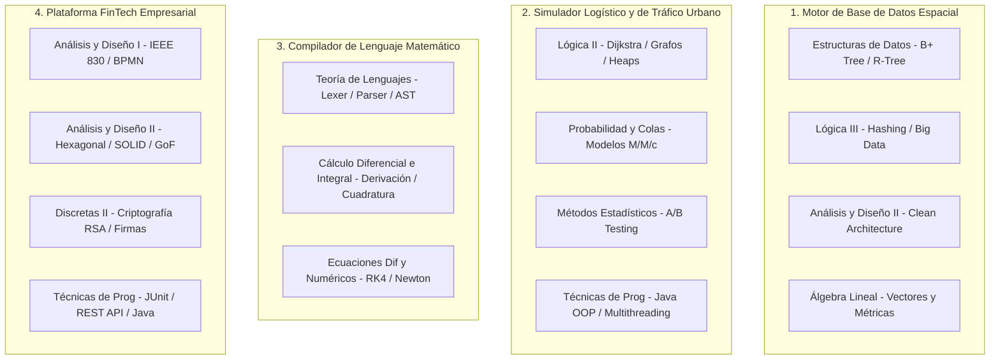

# Hoja de Ruta y Portafolio de Proyectos por Materia
### Programa Oficial de Ingeniería de Sistemas – Universidad de Antioquia (UdeA)

Bienvenido a la guía exhaustiva de proyectos de software, algoritmia y modelado matemático estructurada a partir de los **18 microcurrículos oficiales** de tu carrera.

Cada documento Markdown en esta carpeta ha sido diseñado minuciosamente para que los proyectos **coincidan al 100% con los saberes, metodologías y unidades temáticas** estipuladas en los programas oficiales aprobados por el Consejo de la Facultad de Ingeniería de la UdeA.

> [!TIP]
> **Pensum Oficial (Programa 506 - Versión 5):**  
> Consulta la correlación de créditos y requisitos de estas asignaturas en el portal:  
> 🔗 **[Pensum Oficial de Ingeniería de Sistemas UdeA (Versión 5)](https://ingenieria2.udea.edu.co/cursum/#/publico/programas/506/pensum)**

---

## 🗺️ Mapa Curricular y Enlaces a los Documentos por Materia

Los 18 cursos se organizan en 4 grandes ejes formativos:

### 💻 Eje 1: Programación, Algoritmia y Big Data
| # | Código | Asignatura | Enlace al Documento de Proyectos |
| :-: | :---: | :--- | :--- |
| **08** | 2554208 | **Lógica y Representación I** | [Ver Proyectos](08_2554208_logica_y_representacion_I.md) |
| **09** | 2554306 | **Lógica y Representación II** | [Ver Proyectos](09_2554306_logica_y_representacion_II.md) |
| **10** | 2554402 | **Lógica y Representación III** | [Ver Proyectos](10_2554402_logica_y_representacion_III.md) |
| **11** | 2554307 | **Técnicas de Programación y Laboratorio** | [Ver Proyectos](11_2554307_tecnicas_de_programacion_y_laboratorio.md) |
| **12** | 2554507 | **Estructuras de Datos y Laboratorio** | [Ver Proyectos](12_2554507_estructuras_de_datos_y_laboratorio.md) |
| **13** | 2554508 | **Teoría de Lenguajes y Laboratorio** | [Ver Proyectos](13_2554508_teoria_de_lenguajes_y_laboratorio.md) |

---

### 🏛️ Eje 2: Ingeniería de Software, Análisis y Arquitectura
| # | Código | Asignatura | Enlace al Documento de Proyectos |
| :-: | :---: | :--- | :--- |
| **14** | 2554403 | **Análisis y Diseño de Sistemas I** | [Ver Proyectos](14_2554403_analisis_y_diseno_de_sistemas_I.md) |
| **15** | 2554506 | **Análisis y Diseño de Sistemas II** | [Ver Proyectos](15_2554506_analisis_y_diseno_de_sistemas_II.md) |

---

### 📊 Eje 3: Probabilidad, Estadística y Modelos Estocásticos
| # | Código | Asignatura | Enlace al Documento de Proyectos |
| :-: | :---: | :--- | :--- |
| **16** | 2554308 | **Teoría de la Probabilidad y Colas** | [Ver Proyectos](16_2554308_teoria_de_la_probabilidad_y_colas.md) |
| **17** | 2554408 | **Métodos Estadísticos** | [Ver Proyectos](17_2554408_metodos_estadisticos.md) |

---

### 📐 Eje 4: Matemáticas Computacionales y Ciencias Básicas
| # | Código | Asignatura | Enlace al Documento de Proyectos |
| :-: | :---: | :--- | :--- |
| **01** | 2559121 | **Geometría Vectorial y Analítica** | [Ver Proyectos](01_2559121_geometria_vectorial_y_analitica.md) |
| **02** | 2559131 | **Cálculo Diferencial** | [Ver Proyectos](02_2559131_calculo_diferencial.md) |
| **03** | 2559231 | **Cálculo Integral** | [Ver Proyectos](03_2559231_calculo_integral.md) |
| **04** | 2559221 | **Álgebra Lineal** | [Ver Proyectos](04_2559221_algebra_lineal.md) |
| **05** | 2567201 | **Física Mecánica** | [Ver Proyectos](05_2567201_fisica_mecanica.md) |
| **06** | 2554207 | **Matemáticas Discretas I** | [Ver Proyectos](06_2554207_matematicas_discretas_I.md) |
| **07** | 2554303 | **Matemáticas Discretas II** | [Ver Proyectos](07_2554303_matematicas_discretas_II.md) |
| **18** | 2554407 | **Ecuaciones Diferenciales y Métodos Numéricos** | [Ver Proyectos](18_2554407_ecuaciones_diferenciales_y_metodos_numericos.md) |

---

## 🌟 Los 4 Mega-Proyectos Integradores para tu Perfil Profesional

Si quieres optimizar tu tiempo y tener un portafolio de nivel sobresaliente en GitHub que asombre a reclutadores técnicos, puedes construir estos 4 proyectos que sintetizan múltiples materias:

### 1. Motor de Base de Datos Espacial Embebido (Geo-DB Engine)
* **Materias:** Estructuras de Datos y Lab + Lógica y Representación III + Álgebra Lineal + Análisis y Diseño II.
* **Descripción:** Sistema de base de datos relacional/espacial que guarda páginas binarias en disco con índice primario en Árbol B+, índice secundario espacial en Árbol R o KD-Tree, y algoritmos de LSH para búsqueda de similitud. Diseñado bajo Arquitectura Hexagonal.

### 2. Simulador de Redes de Transporte Urbano con Teoría de Colas y Tráfico
* **Materias:** Lógica y Representación II + Teoría de la Probabilidad y Colas + Métodos Estadísticos + Técnicas de Programación.
* **Descripción:** Simulación de una flota de vehículos de entrega o transporte masivo sobre un grafo dirigido ponderado con cálculo de rutas mínimas (Dijkstra), arribos estocásticos de pasajeros (Poisson), tiempos de espera analíticos vs simulados ($M/M/c$) y experimentación A/B de políticas de despacho.

### 3. Compilador y Entorno de Cálculo Científico Autónomo (MathScript)
* **Materias:** Teoría de Lenguajes y Lab + Ecuaciones Diferenciales y Métodos Numéricos + Cálculo Diferencial e Integral + Geometría Vectorial.
* **Descripción:** Un lenguaje de programación formal con Lexer, Parser y evaluador que permite escribir fórmulas matemáticas, resolver derivadas simbólicas, integrar numéricamente con Simpson y simular sistemas de ecuaciones diferenciales con Runge-Kutta 4.

### 4. Plataforma FinTech con Criptografía y Arquitectura Hexagonal
* **Materias:** Análisis y Diseño I + Análisis y Diseño II + Matemáticas Discretas II + Técnicas de Programación y Lab.
* **Descripción:** Sistema financiero que cuenta con expediente formal de requerimientos (IEEE 830 y BPMN), arquitectura limpia hexagonal en Java/Spring Boot, patrones de diseño GoF, pruebas unitarias con JUnit, y módulo de firma digital y cifrado asimétrico basado en RSA implementado desde cero.

---

## 🎯 Recomendaciones para Presentar estos Proyectos en tu Portafolio
1. **Un Repositorio por Proyecto en GitHub:** Con un `README.md` impecable que incluya:
   * Diagrama de arquitectura (C4 o UML).
   * Justificación teórica y fórmulas matemáticas implementadas.
   * Instrucciones de instalación y ejecución en Docker o entorno local.
   * Suite de pruebas unitarias automatizadas pasando (`All tests green`).
   * GIF o video demostrativo de la interfaz o terminal en funcionamiento.
2. **Documenta los Trade-offs:** En cada proyecto, explica por qué elegiste una estructura de datos o un algoritmo frente a otro (ej. *"Se eligió Árbol B+ sobre Árbol B porque los nodos hoja secuencialmente enlazados reducen drásticamente las operaciones I/O en lecturas de rango"*). Eso es lo que buscan los evaluadores técnicos Senior.
